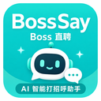

<div align="center">



# BossSay

**Boss直聘 AI 智能打招呼助手**

扫描岗位 → AI 匹配简历 → 生成个性化消息 → 一键填入


</div>

---

## 它能做什么

在 Boss直聘搜索页，一键扫描岗位信息，AI 自动结合你的简历生成**个性化打招呼消息**。

每条消息都不一样——因为每个岗位的 JD 不同，你的匹配点也不同。

**传统方式：**

> "你好，我对这个岗位很感兴趣，希望有机会进一步沟通。"

**BossSay 生成：**

> "我有 2 年 React 开发经验，独立负责过日活 10 万的小程序重构。看到你们要前端开发，技术栈很匹配。随时到岗，可以长期实习，希望转正。请问团队目前主要用 React 还是 Vue？"

HR 看到第二条，回复率高得多。

---

## 快速开始

### 1. 安装

1. 下载本仓库（Code → Download ZIP）并解压
2. 打开 Chrome/Edge，地址栏输入 `chrome://extensions/` 或 `edge://extensions/`
3. 打开右上角「开发者模式」
4. 点「加载已解压的扩展程序」，选择解压后的文件夹

### 2. 配置 AI

1. 点击工具栏的 BossSay 图标
2. 切换到 **⚙️ 设置** 页签
3. 填写 API 配置：

| 提供商 | API 地址 | 推荐模型 |
|--------|----------|----------|
| DeepSeek | `https://api.deepseek.com/v1` | deepseek-chat |
| OpenAI | `https://api.openai.com/v1` | gpt-4o-mini |
| 通义千问 | `https://dashscope.aliyuncs.com/compatible-mode/v1` | qwen-plus |

4. 点「💾 保存」→「🔗 测试连接」

### 3. 填写简历

切换到 **👤 资料** 页签：

- **上传 PDF** — AI 自动提取简历信息（支持文字版和扫描件）
- **手动填写** — 简历摘要、工作经历、技能标签等
- **求职状态** — 到岗时间、实习时长、求职类型、转正意愿

### 4. 使用

1. 打开 Boss直聘搜索页（`zhipin.com/geek/jobs`）
2. 点击页面右下角的 **BossSay** 按钮
3. 点 **🔍 扫描当前页面岗位**
4. （可选）从详情页复制 JD 粘贴到输入框
5. 选择消息风格，点 **✨ AI 生成打招呼消息**
6. 点 **📝 填入输入框**，消息自动填入聊天窗口

---

## 功能一览

| 功能 | 说明 |
|------|------|
| 🔍 岗位扫描 | 从搜索页自动提取职位、公司、薪资、地点、经验、学历 |
| 🤖 AI 消息生成 | 结合简历和 JD，从 HR 视角生成三段式个性化消息 |
| 📄 PDF 简历上传 | 上传 PDF 自动提取简历信息，支持扫描件 OCR |
| 🎨 四种风格 | 专业正式 / 热情亲切 / 幽默轻松 / 简洁明了 |
| 📝 一键填入 | 生成的消息直接填入 Boss直聘聊天输入框 |
| 🖱️ 浮动按钮 | 页面右下角 BossSay 按钮，随时打开 |
| ⌨️ 快捷键 | 浏览器扩展快捷键（在 `edge://extensions/shortcuts` 设置） |
| 💾 备份恢复 | 导出/导入设置 JSON，换设备不丢失 |
| 📋 历史记录 | 保存生成过的消息，方便复盘 |

---

## AI 消息设计

每条消息遵循**三段式结构**，从 HR 视角出发：

```
第一段：能力匹配
  → 用简历中真实有的技能和经历，匹配 JD 要求
  → "我有 XX 经验，做过 YY 项目，和你们要的 ZZ 很匹配"

第二段：到岗信息
  → 到岗时间、实习时长、转正意愿
  → 这是 HR 最关心的筛选条件

第三段：收尾提问
  → 跟岗位相关的具体问题
  → 展示你认真看过 JD，有思考
```

**铁律：绝对不编造简历中没有的经历和数据。** 宁可说少，不能说假。

---

## 项目结构

```text
BossSay/
├── manifest.json                 Chrome 扩展配置
├── popup/                        弹窗界面
│   ├── popup.html                四页签：生成、资料、设置、更多
│   ├── popup.js                  扫描、生成、PDF上传、设置管理
│   └── popup.css                 新海诚蓝色主题样式
├── content/
│   ├── content.js                搜索页卡片提取、消息填入、浮动按钮
│   └── content.css
├── background/
│   └── service-worker.js         存储读写、AI API 代理、导出导入
├── lib/
│   ├── ai-client.js              HR 视角 prompt + API 调用
│   ├── pdf-extractor.js          PDF 文字提取 + 图片渲染
│   ├── pdf.min.js                pdf.js 库
│   └── pdf.worker.min.js         pdf.js Worker
├── icons/                        扩展图标
├── options/
│   └── options.html              设置页面
└── docs/
    └── PROJECT.md                项目全景文档（产品/技术/竞品/面试）
```

---

## 技术亮点

**1. 反爬对抗**

Boss直聘用 CSS 混淆 + 自定义字体反爬，详情页的 JD 内容无法直接提取。我们的方案：从搜索页卡片提取（不混淆），JD 手动粘贴。参考了竞品 BOSSING 的实现。

**2. CORS 代理**

Chrome 扩展 popup 直接 fetch 外部 API 会遇到 CORS 限制。所有 API 调用通过 service worker 代理，利用 `host_permissions` 绕过 CORS。

**3. PDF OCR**

对于扫描件 PDF，用 pdf.js 渲染每页为图片，发给 AI 视觉模型做文字识别。不需要额外的 OCR 库。

**4. Prompt 工程**

从 HR 视角设计 prompt：禁止编造、三段式结构、四风格支持、反面教材。每条消息 80-150 字，直接说匹配点，不寒暄。

---

## 支持的模型

任何兼容 OpenAI Chat Completions API 的模型均可使用。

扫描件 PDF 的 OCR 功能需要支持图片输入的视觉模型（如 GPT-4o、Claude Sonnet）。

---

## 文档

- [项目全景文档](docs/PROJECT.md) — 产品分析、技术架构、竞品分析、面试准备

---

## License

MIT
